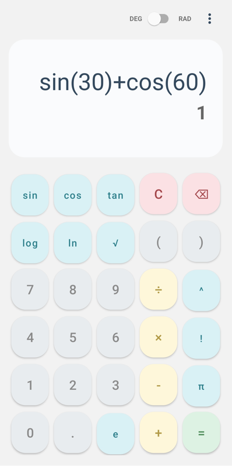
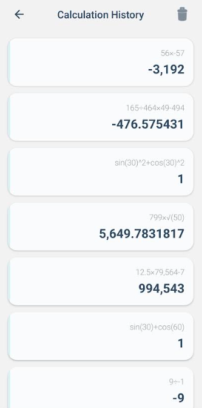
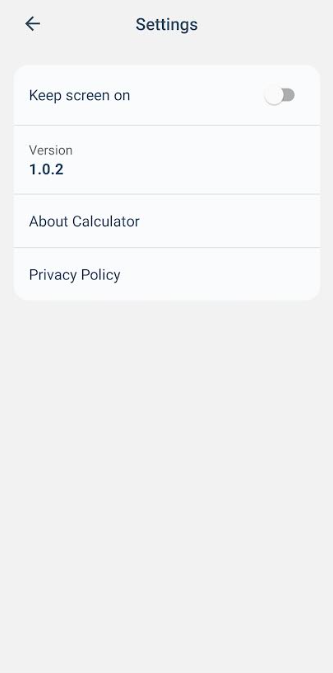
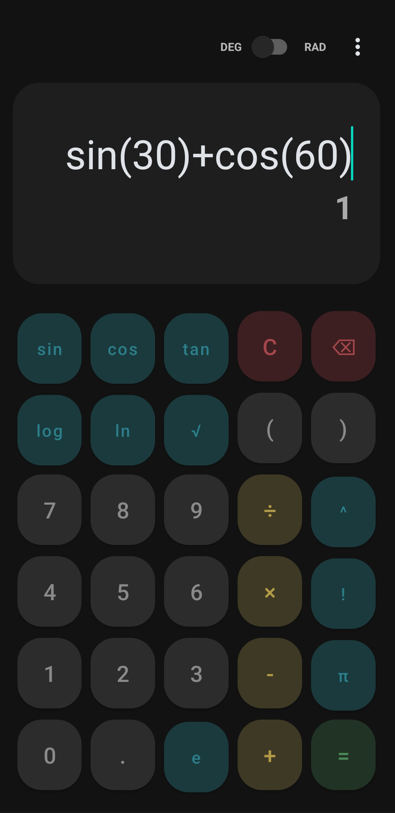
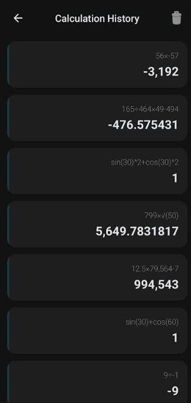
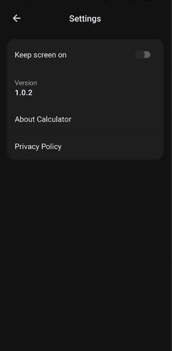

# 📱 Advanced Scientific Calculator

A lightweight yet powerful scientific calculator for Android, delivering precise results with smart input logic and a clean Material 3 interface.

---

## 📸 Screenshots

### 🌗 Light Mode vs Dark Mode

  
  
  

  <b>Main</b> &nbsp;&nbsp;&nbsp;&nbsp;&nbsp;
  <b>History</b> &nbsp;&nbsp;&nbsp;&nbsp;&nbsp;
  <b>Settings</b>

 

  
  
  

  <b>Main</b> &nbsp;&nbsp;&nbsp;&nbsp;&nbsp;
  <b>History</b> &nbsp;&nbsp;&nbsp;&nbsp;&nbsp;
  <b>Settings</b>

---

## ✨ Key Features

### 🧪 Scientific Functions
- Trigonometry: `sin`, `cos`, `tan` (Degree & Radian mode)
- Logarithmic: `log`, `ln`
- Constants: `π`, `e`
- Supports complex nested expressions

### ⚡ Smart Input Engine
- Intelligent operator replacement (no duplicate operators)
- Supports negative numbers (e.g., `2÷-1`)
- Real-time expression evaluation

### 📜 History System
- Stores last 50 calculations
- Tap to reuse previous results

### 🎨 UI & UX
- Material Design 3 interface
- Dark & Light theme support
- Clean and responsive layout

---

## 🛠 Tech Stack

- Java (Android)
- exp4j (Expression evaluation engine)
- Gson (History storage)
- SharedPreferences (Settings)
- Material Components

---

## 📦 Releases

👉 Latest Version: [v1.0.4](https://github.com/CodedByManish/Android-Calculator-app/releases/tag/v1.0.5)

Download APK from the Releases section and install on Android devices.

---

## 📊 Version History

| Version | Status | Highlights |
|--------|--------|------------|
| v1.0.4 | Stable | UI & content improvements (About & Privacy) |
| v1.0.3 | Stable | Smart operator logic + Info screens |
| v1.0.2 | Stable | History system + performance fixes |
| v1.0.1 | Beta | Initial scientific calculator release |

---

## 👨‍💻 Developer

**Manish Kafle**  
GitHub: [CodedByManish](https://github.com/CodedByManish)

---

## 📜 License

This project is licensed under the MIT License.

---

## ⭐ Support

If you like this project:
- ⭐ Star the repository
- 🍴 Fork it
- 🚀 Share it with others  
