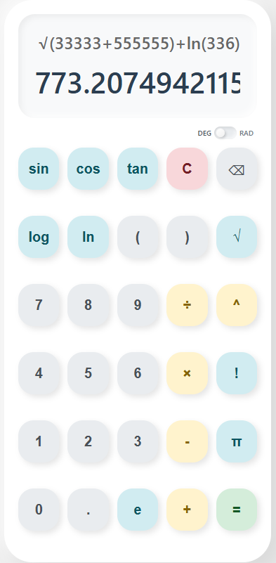

## 📱 Android Calculator

A sleek, minimalist, and high-performance calculator built with **Java** and **Material Design 3**. This app features a clean "Light-White" aesthetic with a responsive grid layout designed for both phones and tablets.

---

### ✨ Features
* **Modern UI/UX**: Stylish rounded buttons (16dp radius) and a floating CardView display.
* **Intuitive Layout**: Balanced 4-column grid with high-contrast functional buttons.
* **Smart Logic**: Handles addition, subtraction, multiplication, and division with error handling (no crashing on division by zero!).
* **Precision**: Automatically removes trailing decimals for whole numbers to keep the screen neat.
* **Responsive**: Optimized for various screen sizes using `GridLayout` and `layout_columnWeight`.

---

### 🎨 Visual Showcase
| **Element** | **Colour** | **Style** |
| :--- | :--- | :--- |
| **Numbers** | Grayish White (`#E0E0E0`) | Rounded, Bold Text |
| **Equals** | Vibrant Green (`#4CAF50`) | Primary Action |
| **Backspace** | Soft Red (`#E53935`) | High Visibility |
| **Background** | Light White (`#F5F5F5`) | Clean & Professional |

---

### 📸 Screenshots
<p align="center">
  
</p>

---

### 🛠️ Tech Stack
* **Language**: Java ☕
* **IDE**: Android Studio
* **Architecture**: XML Layouts + Material Components
* **UI Components**: `CardView`, `GridLayout`, `MaterialButton`

---

### 🚀 Getting Started
1. **Clone the repo:**
   ```bash
   git clone [https://github.com/CodedByManish/Android-Calculator-app.git](https://github.com/CodedByManish/Android-Calculator-app.git)
   ```

2. **Open in Android Studio**: Select the project folder and let Gradle sync.
3. **Build APK**: Go to `Build > Build Bundle(s) / APK(s) > Build APK(s)`.
4. **Run**: Deploy to a virtual device (API 34+ recommended) or a physical Android phone.

---

### 📂 File Structure
* **MainActivity.java** - Core calculation logic and button listeners.
* **activity_main.xml** - The UI structure and responsive grid.
* **themes.xml** - Custom styles for the rounded, coloured buttons.
* **AndroidManifest.xml** - App configuration and entry point.

---

### 🤝 Contributing
I’m always open to corrections or suggestions! If you find a bug or want to suggest a feature:

1. **Fork** the project.
2. **Create your Feature Branch** (`git checkout -b feature/NewFeature`).
3. **Commit your changes** (`git commit -m 'Add NewFeature'`).
4. **Push to the Branch** (`git push origin feature/NewFeature`).
5. **Open a Pull Request**.

